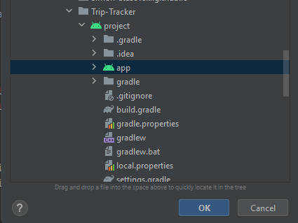
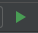

# Trip-Tracker

1. To run this project, make sure to install Android Studio and to have virtual machine prepared (pixel 2 or higher recommanded).
2. The minumum sdk (another name for android version) is 26
3. To open the project, open android studio and click on the open button.
4. Locate the folder of this project and click ok for the app folder as shown below:

   
5. Wait for the Gradle file to build the solution
6. Once that is done, click on this button to run the project: 
